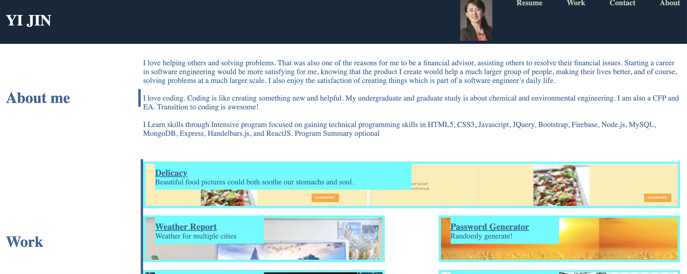
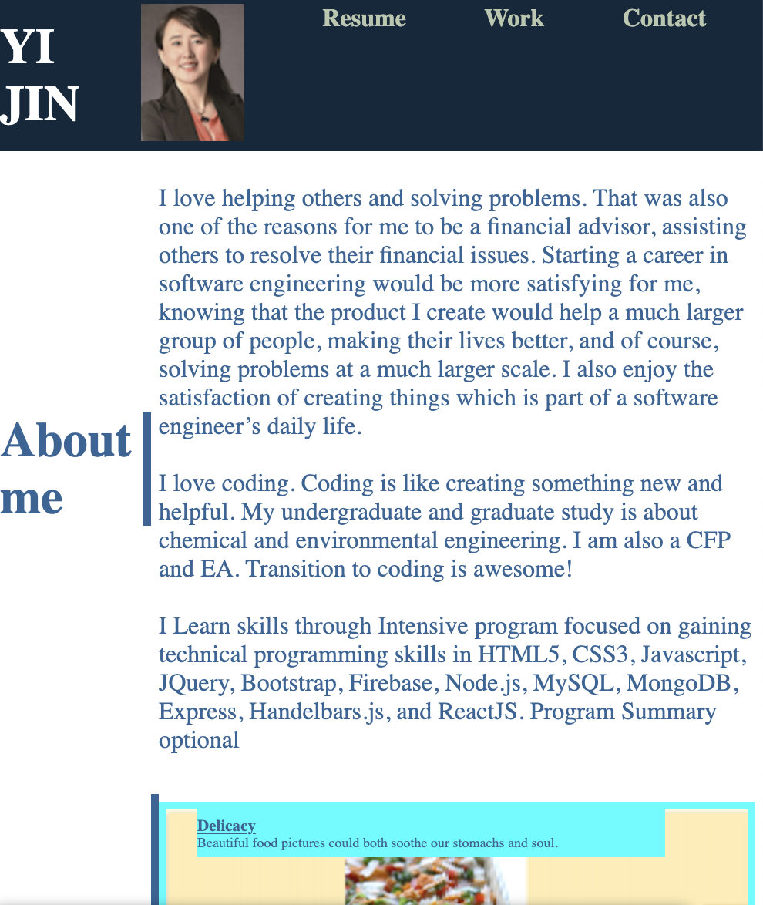

# secondPortfolio

The URL of the functional, deployed, mobile responsive application:
https://kayjinyi.github.io/secondPortfolio/

- [Descripttion](#descripttion)
- [Mock-Up](#mock-up)
- [Questions](#questions)

---

## Descripttion

- Name, a recent photo or avatar, links to sections about them, their work, and how to contact
- Those nav links can be clicked and will scroll to the corresponding section
- The link "about work" scrolls to a section with titles images of the developers applications
- The first application in the work section should be larger in size than the others
- Clicking on the images of the applications should bring you to that deployed application
- The layout of the page is responsive and adapts to the viewport so that it may be viewed on various sized screens and devices

---

## Mock-Up

The following images show the web application's appearance and functionality:

Generic Laptop:

 

 

iPhone (375px viewport)

 

## Questions

Feel free to reach out via Github or email with any questions.  
[Github](https://github.com/kayjinyi)  
[email](mailto:kayjinyi@gmail.com)

---
