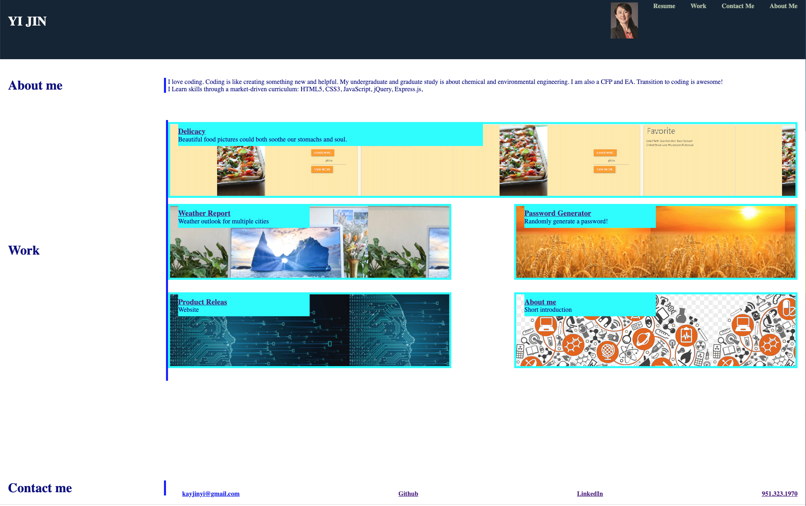

# secondPortfolio
The deployed website is 
https://kayjinyi.github.io/secondPortfolio/

 Create a web application from scratch! This week, you'll build a portfolio page, which you can add to as the course progresses. 

A portfolio of work can showcase your skills and talents to employers looking to fill a part-time or full-time position. An effective portfolio highlights your strongest work as well as the thought processes behind it. Students who have portfolios with deployed web applications (meaning they are live on the web) are typically very successful in their career search after the boot camp. This last point can’t be stressed enough: having several deployed projects is a minimum requirement to receive an initial interview at many companies. 

* My portfolio looks like

    